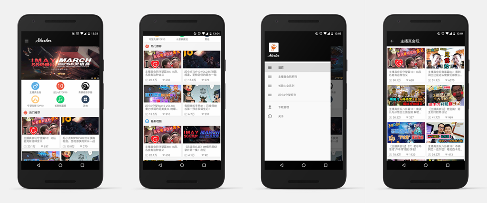
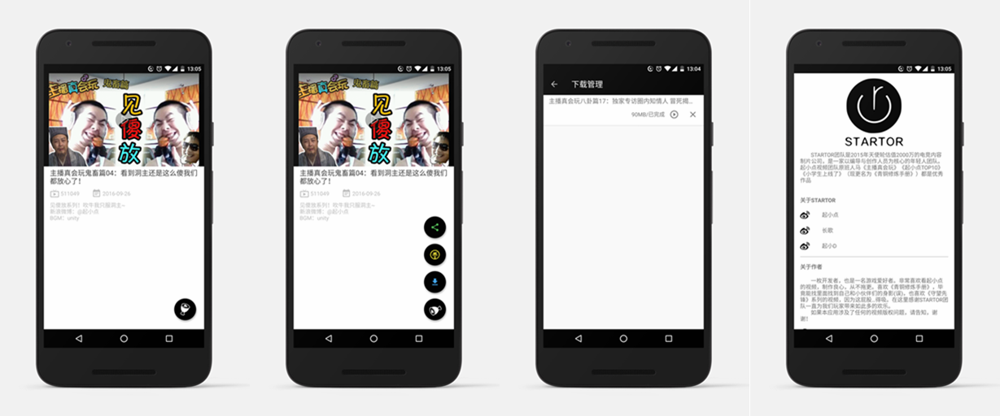

>起小点视频集

## 是大腿

## 截图

## 介绍

一枚刚毕业的Android Developer(这样说比较帅,总不能老说自己是码农嘛 ;¬_¬ ),也是一枚游戏的爱好者,平时喜欢看看游戏视频,一直都有看起小点的视频.最近又迷上吸屁股(误),所以也有看起小D的视频,所以索性就写个APP看.(也不是什么理由,现在的状态就是想写什么就写点什么,毕竟还是在不断学习的阶段,什么都尝试下).

暂时不放出APK下载吧,感觉还不够满意.

如果你喜欢本项目,希望可以star,如果有问题,可以提issue.

## 更新日志

#### v0.2.4
* 最初版本,修复API

## 关于数据源

应用内的所有数据均来自[B站](http://www.bilibili.com/),如果本项目侵犯了[B站](http://www.bilibili.com/)和[STARTOR ](http://startor.cn/)团队的视频版权,请及时告知,本人及时删除本项目.

需要相关的API可以看以下.虽然官方已经不对外开放相关的API,不过你可以拥抱开源社区,仔细找找总会有╮(￣▽￣)╭
* bilibili官方文档搬运
[BilibiliAPIDocs](https://github.com/fython/BilibiliAPIDocs)

还有就是APPKEY的问题.直接编译本项目是不行的,需要将你拥有的B站APPKEY填写在[BilibiliKey]()这个项目文件中.请求视频信息和播放地址的获取都需要APPKEY.

## Built with the help of these awesome libraries

* [RxJava](https://github.com/ReactiveX/RxJava)
* [RxAndroid](https://github.com/ReactiveX/RxAndroid)
* [glide](https://github.com/bumptech/glide)
* [Volley](https://github.com/mcxiaoke/android-volley)
* [gson](https://github.com/google/gson)
* [JieCaoVideoPlayer](https://github.com/lipangit/JieCaoVideoPlayer)
* [BaseRecyclerViewAdapterHelper](https://github.com/CymChad/BaseRecyclerViewAdapterHelper)
* [FileDownloader](https://github.com/lingochamp/FileDownloader)
* [FloatingActionButton](https://github.com/Clans/FloatingActionButton)
* [RollViewPager](https://github.com/Jude95/RollViewPager)

## TODO

* 1 代码写得很丑,用MVP重构项目.刚开始想着MVP很冗余,到后来业务逻辑多了就想起MVP的好.
* 2 更换视频播放为B站开源的ijkplayer,计划会加上弹幕,B站开源"烈焰弹幕使",名字很中二,很想尝试一下.
* 3 使用自己的Adapter.BaseRecyclerViewAdapterHelper很不错的一个库,但是有些需求我想还是自己实现比较好.
* 4 添加分享功能

## 关于我

一枚刚毕业的Android Developer,自学安卓开发一年多.正在寻求工作,如果看上小弟,请务必联系,非常感谢. 

email: temoa_yui@163.com

如果有想和我交流的开发心得的同学,互粉一下微博~
