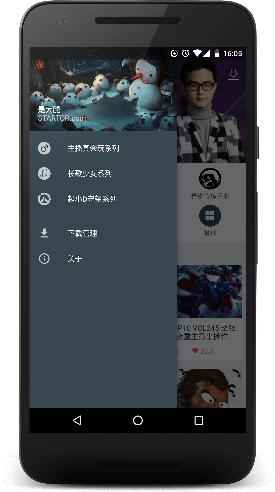
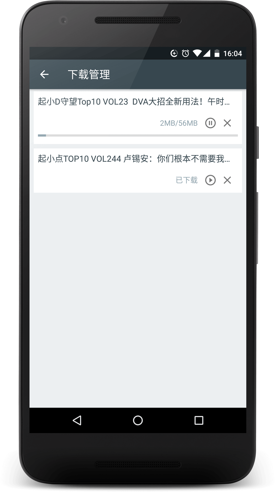
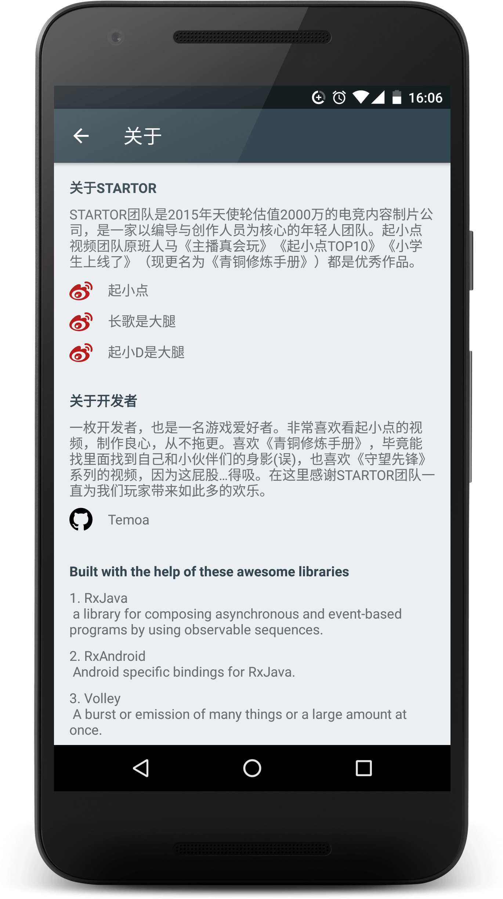

### 是大腿

>起小点视频集

## 截图

<p>






</p>

## 介绍

一枚的Android Developer(这样说比较帅,总不能老说自己是码农嘛 ;¬_¬ ), 也是一枚游戏的爱好者, 平时喜欢看看游戏视频, 一直都有看起小点的视频。最近又迷上吸屁股(误), 所以也有看起小D的视频, 所以索性就写个APP看。(也不是什么理由,现在的状态就是想写什么就写点什么, 毕竟还是在不断学习的阶段,什么都尝试下)。

如果你喜欢本项目，希望可以star, 如果有问题, 可以提issue。不足之处，请多多指出。

## 下载

[Fir.im](http://fir.im/startor)

## 更新日志

* v0.2.4
    * 最初版本, 修复API

* v0.2.5
    * 使用MVP进行重构
    * 修改了APP的总体界面
    * 视频下载功能被屏蔽, 感觉逻辑不行
    * 替换为自己实现的RecyclerView

* v0.2.6
    * 添加微信分享功能
    * 添加权限检查（之前无耻的将SDK 降低为21，避免了程序安装后获取权限）
    * 优化界面、修复BUG
    * 完成视频下载功能，模仿了[FileDownloader](https://github.com/lingochamp/FileDownloader) Adapter 的写法

已知BUG
* 分类页面[CategoryActivity ](https://github.com/Temoa/Startor/blob/master/app/src/main/java/com/temoa/startor2/CategoryActivity.java), 不知道什么原因, "守望先锋TOP10"分类中, 当再无数据添加时, 调用了loadCompleted() ,不会显示RecyclerView 的Footer, 其他分类都正常!

* 下载的速度可能比较慢。和程序没关系，B站大会员你懂的，毕竟我不是╮(￣▽￣)╭

* 热门推荐的算法我在考虑如何实现才好，暂时这个是有问题的

## 关于数据源

应用内的所有数据均来自[B站](http://www.bilibili.com/), 如果本项目侵犯了[B站](http://www.bilibili.com/)和[STARTOR ](http://startor.cn/)团队的视频版权, 请及时告知, 本人及时删除本项目。

需要相关的API可以看以下。 虽然官方已经不对外开放相关的API。 不过你可以拥抱开源社区, 仔细找找总会有╮(￣▽￣)╭
* bilibili官方文档搬运
[BilibiliAPIDocs](https://github.com/fython/BilibiliAPIDocs)

直接编译本项目是不行的, 需要将你拥有的B站APPKEY填写在项目中的*Config.java*。请求视频信息和播放地址的获取都需要APPKEY。

当然还有微信分享的APPKEY, 也需要填写进去，还要处理打包的问题，balabala...最简单是直接下载APK，往上滚动页面


## Built with the help of these awesome libraries

* [RxJava](https://github.com/ReactiveX/RxJava)
* [RxAndroid](https://github.com/ReactiveX/RxAndroid)
* [glide](https://github.com/bumptech/glide)
* [Volley](https://github.com/mcxiaoke/android-volley)
* [gson](https://github.com/google/gson)
* [JieCaoVideoPlayer](https://github.com/lipangit/JieCaoVideoPlayer)
* [FileDownloader](https://github.com/lingochamp/FileDownloader)
* [RollViewPager](https://github.com/Jude95/RollViewPager)

## TODO

* 1 ~~代码写得很丑, 用MVP重构项目.刚开始想着MVP很冗余, 到后来业务逻辑多了就想起MVP的好。~~
* 2 更换视频播放为B站开源的ijkplayer, 计划会加上弹幕, B站开源"烈焰弹幕使", 名字很中二, 很想尝试一下。
* 3 ~~使用自己的Adapter.BaseRecyclerViewAdapterHelper很不错的一个库, 但是有些需求我想还是自己实现比较好。~~
* 4 ~~添加分享功能。~~

## 关于我

[](http://weibo.com/lailaizuiaiyiyi/profile?rightmod=1&wvr=6&mod=personinfo)

一枚的Android Developer。

email: temoa_yui@163.com

如果有想和我交流的开发心得的同学, 互粉一下微博。私信一下说明来意。

## LICENSE
```
   Copyright 2016 Temoa Lai

   Licensed under the Apache License, Version 2.0 (the "License");
   you may not use this file except in compliance with the License.
   You may obtain a copy of the License at

       http://www.apache.org/licenses/LICENSE-2.0

   Unless required by applicable law or agreed to in writing, software
   distributed under the License is distributed on an "AS IS" BASIS,
   WITHOUT WARRANTIES OR CONDITIONS OF ANY KIND, either express or implied.
   See the License for the specific language governing permissions and
   limitations under the License.

```
